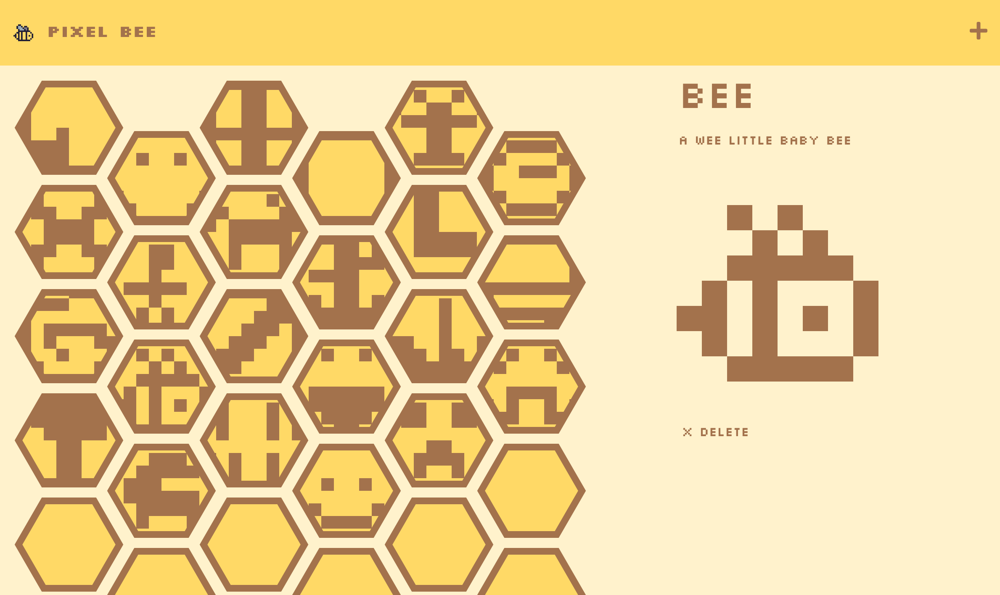

#  Pixel Bee

## Description

[Click here to visit the live website.](https://pixelbee-cad6c3eb77b1.herokuapp.com/)

A beehive themed pixel art drawing board that allows the whole world to pitch in.

The aim of this project is to provide a space for users to anonymously view and publish minimalist pixel art. Every user can feel like they are making a worthwhile addition to the hive as they draw in one or more cells.

## Usage

Users may do the following:

- Click the **"Draw a Cell"** button to be taken the cells page

- Click on a drawn cell to view its contents
- Click the **"Delete"** button to remove a cell deemed inappropriate

- Click on an empty cell or the **"+"** button to fill a new cell
- Type in a cell title and description
- Click and hold on the drawing grid to fill or erase pixels
- Click the **"Clear"** button to erase the drawing grid
- Click on the **Save Icon** button to publish the cell

## Credits
- Frontend starter code by [edX Boot Camps LLC](https://github.com/coding-boot-camp/miniature-eureka)
  - transformed into Pixel Bee by me
- Font: Silkscreen by [Jason Kottke](https://www.1001fonts.com/silkscreen-font.html)
- Hexagon SVG points by [Chris Manning](https://codepen.io/cwmanning/pen/MWeOYR)
- Pixel Bee logo by me